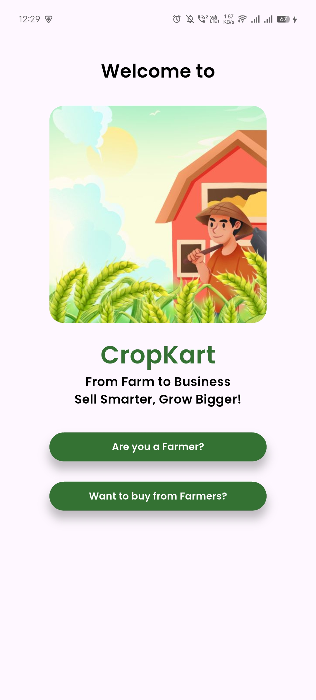
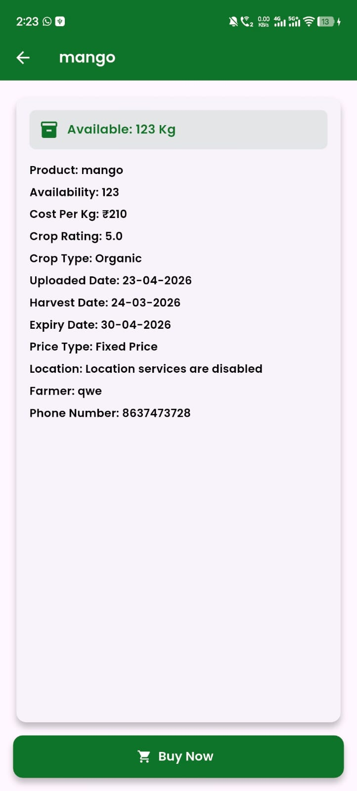
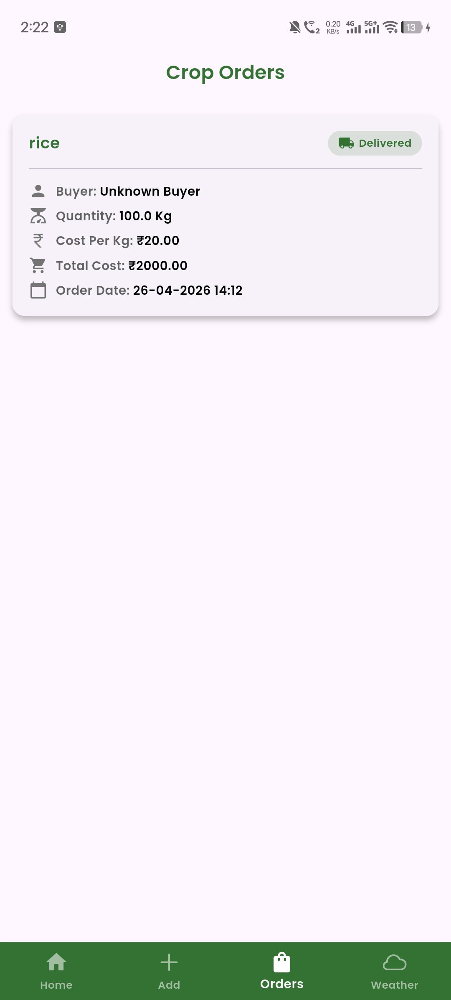
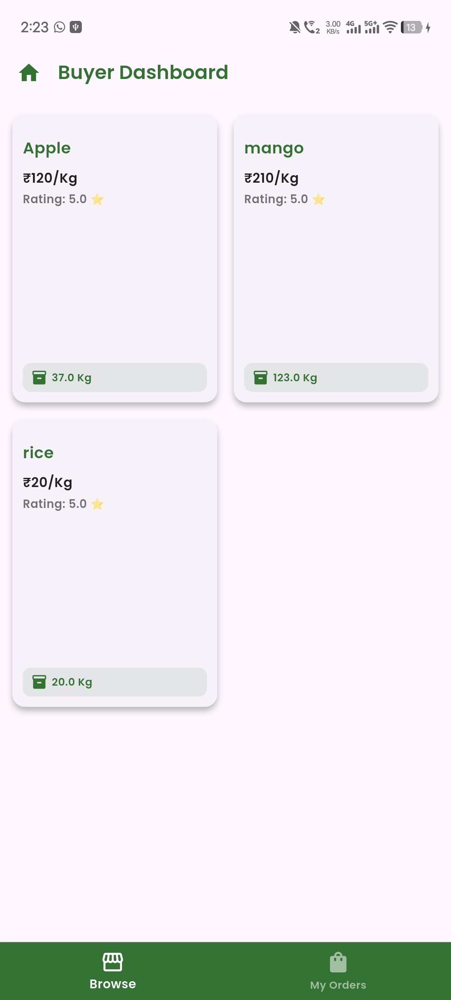
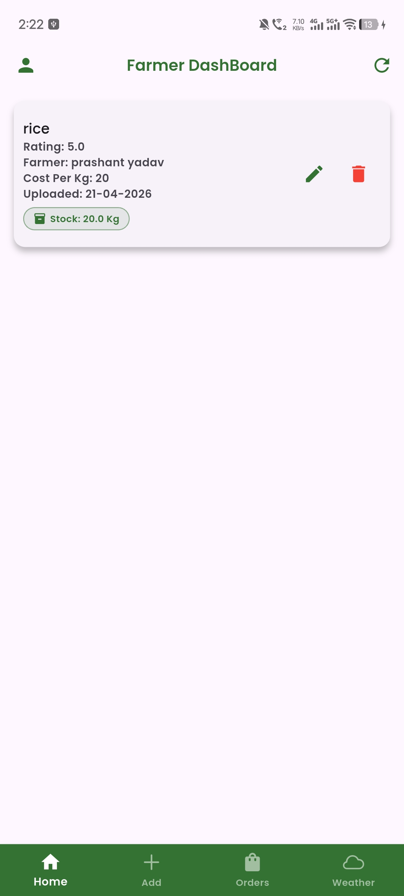
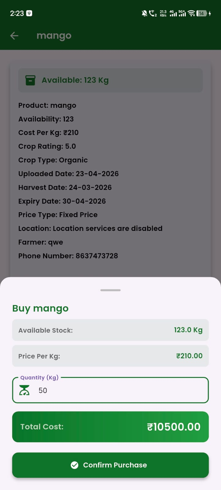
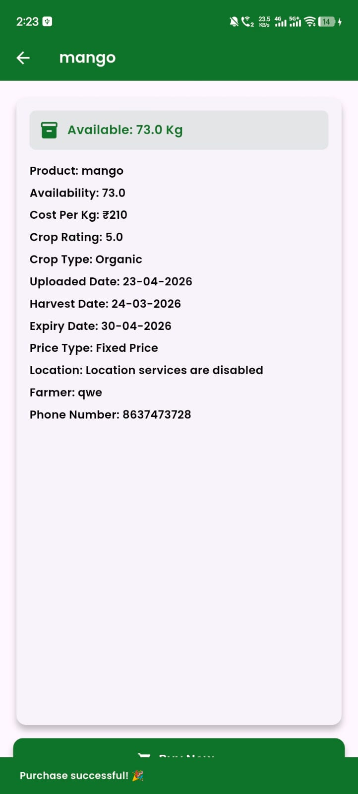
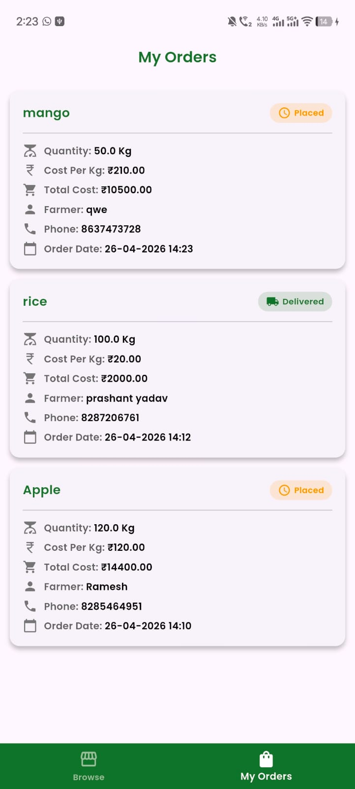

# 🌾 CropKart

> **Connecting Farmers with Businesses — Direct Crop Sales Made Simple**

CropKart is a Flutter-based mobile application that bridges the gap between farmers and businesses, enabling direct crop sales without intermediaries. Built with modern technologies and real-time capabilities, CropKart streamlines agricultural commerce.

[](https://flutter.dev)
[](https://firebase.google.com)
[](https://dart.dev)
[](LICENSE)

---

## ✨ Features

### 👨‍🌾 For Farmers

- **Crop Listings** — Add, update, and delete crop listings with ease
- **Real-time Visibility** — Your crops are instantly visible to potential buyers
- **Location Services** — Share your farm location to connect with nearby businesses
- **Weather Updates** — Stay informed with animated weather forecasts for better crop planning
- **Rating System** — Receive ratings from buyers to build trust and credibility
- **Order Notifications** — Get instantly notified via real-time Firestore listeners when a buyer places an order
- **Accept or Reject Orders** — Review incoming orders (crop name + quantity in kg) and accept or decline them
- **Order Fulfillment** — Mark accepted orders as **Delivered** once the crop is dispatched

### 🏢 For Businesses / Buyers

- **Browse Crops** — Access a comprehensive catalog of available crops
- **Smart Search** — Search and filter crops using dropdown search with auto-suggestions
- **Location-based Discovery** — Find farmers in your vicinity
- **Purchase Crops** — Select any crop and specify the quantity (in kg) to place an order directly with the farmer
- **Real-time Order Status** — Get live updates in your dashboard the moment a farmer accepts, rejects, or delivers your order — powered by Firestore real-time listeners
- **Order History** — Track all past and current orders in one place

### 🔄 Order Lifecycle

```
Buyer selects crop & quantity (kg)
        ↓
Order placed → saved to Firestore
        ↓
Farmer receives real-time notification
        ↓
Farmer accepts ──────────────────────→ Farmer rejects
        ↓                                     ↓
Farmer marks as Delivered            Buyer notified (Rejected)
        ↓
Buyer notified (Delivered) ✅
```

### 🔐 Security & Authentication

- Secure email/password authentication via Firebase Auth
- Separate dashboards for farmers and buyers
- Protected user data and transactions

---

## 🛠️ Tech Stack

| Technology | Version | Purpose |
|---|---|---|
| **Flutter SDK** | ≥ 3.x | Cross-platform mobile development |
| **Dart SDK** | ^3.7.2 | Programming language |
| **Firebase Core** | ^4.3.0 | Backend infrastructure |
| **Firebase Auth** | ^6.1.3 | User authentication |
| **Cloud Firestore** | ^6.1.1 | Real-time NoSQL cloud database |
| **Geolocator** | ^14.0.2 | Device location tracking |
| **Geocoding** | ^4.0.0 | Coordinates to readable addresses |
| **Weather Animation** | ^1.1.2 | Animated weather display |
| **Custom Rating Bar** | ^3.0.0 | Star-rating UI for crop/farmer reviews |
| **Dropdown Search** | ^6.0.2 | Searchable dropdown fields |
| **Drop Down Search Field** | ^1.2.2+1 | Advanced search-as-you-type field |
| **HTTP** | ^1.6.0 | REST API calls (OpenWeatherMap) |
| **Intl** | ^0.20.2 | Internationalization & date formatting |
| **Flutter Launcher Icons** | ^0.14.4 | Custom app icon generation |

---

---
## 📱 App Screenshots

<table>
  <tr>
    <td align="center">
      
      <br />
      <sub><b> </b></sub>
    </td>
    <td align="center">
      
      <br />
      <sub><b></b></sub>
    </td>
    <td align="center">
      
      <br />
      <sub><b> </b></sub>
    </td>
  </tr>
  <tr>
    <td align="center">
      
      <br />
      <sub><b> </b></sub>
    </td>
    <td align="center">
      
      <br />
      <sub><b> </b></sub>
    </td>
    <td align="center">
      
      <br />
      <sub><b> </b></sub>
    </td>
  </tr>
  <tr>
    <td align="center">
      
      <br />
      <sub><b> </b></sub>
    </td>
    <td align="center">
      
      <br />
      <sub><b> </b></sub>
    </td>
    <td align="center">
      
      <br />
      <sub><b> </b></sub>
    </td>
  </tr>
   <tr>
    <td align="center">
      
      <br />
      <sub><b> </b></sub>
    </td>
    <td align="center">
      
      <br />
      <sub><b></b></sub>
    </td>
    <td align="center">
      
      <br />
      <sub><b></b></sub>
    </td>
  </tr>
   <tr>
    <td align="center">
      
      <br />
      <sub><b></b></sub>
    </td>
    <td align="center">
      
      <br />
      
  </tr>
  <table>
  <tr>
    <td align="center">
      
      <br />
      <sub><b>Crop Detail — Buy Now</b></sub>
    </td>
    <td align="center">
      
      <br />
      <sub><b>Farmer Dashboard</b></sub>
    </td>
    <td align="center">
      
      <br />
      <sub><b>Crop Orders (Farmer View)</b></sub>
    </td>
  </tr>
  <tr>
    <td align="center">
      
      <br />
      <sub><b>Buyer Dashboard — Browse Crops</b></sub>
    </td>
    <td align="center">
      
      <br />
      <sub><b>Farmer Dashboard — Stock View</b></sub>
    </td>
    <td align="center">
      
      <br />
      <sub><b>Buy Crop — Select Quantity & Total Cost</b></sub>
    </td>
  </tr>
  <tr>
    <td align="center">
      
      <br />
      <sub><b>Purchase Successful — Stock Updated</b></sub>
    </td>
    <td align="center">
      
      <br />
      <sub><b>My Orders — Buyer Order Tracking</b></sub>
    </td>
  </tr>
</table>
</table>

## 📋 Prerequisites

Before you begin, ensure you have the following installed:

- Flutter SDK (v3.x or higher)
- Dart SDK ^3.7.2
- Android Studio **or** Visual Studio Code
- Xcode *(for iOS development on macOS)*
- Git
- A Firebase account

---

## 🚀 Installation

### 1️⃣ Clone the Repository

```bash
git clone https://github.com/prashant000000004/cropKart.git
cd cropKart
```

### 2️⃣ Install Dependencies

```bash
flutter pub get
```

### 3️⃣ Configure Weather API

1. Sign up for a free API key at [OpenWeatherMap](https://openweathermap.org/api)
2. Navigate to `lib/ApiKey.dart`
3. Replace the placeholder with your API key:

```dart
const String apiKey = 'YOUR_OPENWEATHERMAP_API_KEY';
```

### 4️⃣ Firebase Setup

#### Enable Authentication

1. Open the [Firebase Console](https://console.firebase.google.com/)
2. Go to **Authentication → Sign-in method**
3. Enable **Email/Password**

#### Set Up Firestore

1. In Firebase Console, go to **Firestore Database**
2. Create the following collections:
   - `farmers`
   - `buyers`
   - `crops`
   - `orders` *(stores order details: crop, quantity, buyer ID, farmer ID, status)*

#### Initialize Firebase

```dart
import 'package:firebase_core/firebase_core.dart';
import 'package:flutter/material.dart';

void main() async {
  WidgetsFlutterBinding.ensureInitialized();
  await Firebase.initializeApp();
  runApp(MyApp());
}
```

### 5️⃣ Generate App Icons *(optional)*

The project uses a custom launcher icon (`assets/images/iconLogo.png`). To regenerate icons after changes:

```bash
flutter pub run flutter_launcher_icons
```

### 6️⃣ Run the App

```bash
flutter run
```

---

## 📦 Dependencies (pubspec.yaml)

```yaml
dependencies:
  flutter:
    sdk: flutter
  firebase_core: ^4.3.0
  firebase_auth: ^6.1.3
  cloud_firestore: ^6.1.1
  geolocator: ^14.0.2
  geocoding: ^4.0.0
  weather_animation: ^1.1.2
  custom_rating_bar: ^3.0.0
  drop_down_search_field: ^1.2.2+1
  dropdown_search: ^6.0.2
  http: ^1.6.0
  intl: ^0.20.2
  flutter_launcher_icons: ^0.14.4
  cupertino_icons: ^1.0.8
```

---

## 💡 Key Code Snippets

### User Authentication

**Sign Up**

```dart
Future<User?> signUp(String email, String password) async {
  try {
    UserCredential userCredential = await FirebaseAuth.instance
        .createUserWithEmailAndPassword(email: email, password: password);
    return userCredential.user;
  } catch (e) {
    print("Error: $e");
    return null;
  }
}
```

**Sign In**

```dart
Future<User?> signIn(String email, String password) async {
  try {
    UserCredential userCredential = await FirebaseAuth.instance
        .signInWithEmailAndPassword(email: email, password: password);
    return userCredential.user;
  } catch (e) {
    print("Error: $e");
    return null;
  }
}
```

### Firestore Operations

**Add Crop Listing**

```dart
final FirebaseFirestore firestore = FirebaseFirestore.instance;

Future<void> addCropData(String cropId, Map<String, dynamic> cropData) async {
  try {
    await firestore.collection('crops').doc(cropId).set(cropData);
  } catch (e) {
    print("Error: $e");
  }
}
```

**Fetch Available Crops**

```dart
Future<QuerySnapshot> getCrops() async {
  return await firestore.collection('crops').get();
}
```

### Order Management

**Place an Order (Buyer)**

```dart
Future<void> placeOrder({
  required String cropId,
  required String farmerId,
  required String buyerId,
  required double quantityKg,
  required String cropName,
}) async {
  await firestore.collection('orders').add({
    'cropId': cropId,
    'cropName': cropName,
    'farmerId': farmerId,
    'buyerId': buyerId,
    'quantityKg': quantityKg,
    'status': 'pending',       // pending | accepted | rejected | delivered
    'createdAt': FieldValue.serverTimestamp(),
  });
}
```

**Farmer Listens for Incoming Orders (Real-time)**

```dart
Stream<QuerySnapshot> getFarmerOrders(String farmerId) {
  return firestore
      .collection('orders')
      .where('farmerId', isEqualTo: farmerId)
      .where('status', isEqualTo: 'pending')
      .snapshots(); // real-time listener
}
```

**Accept / Reject / Deliver an Order (Farmer)**

```dart
Future<void> updateOrderStatus(String orderId, String status) async {
  // status: 'accepted' | 'rejected' | 'delivered'
  await firestore.collection('orders').doc(orderId).update({
    'status': status,
    'updatedAt': FieldValue.serverTimestamp(),
  });
}
```

**Buyer Listens for Order Status Updates (Real-time)**

```dart
Stream<QuerySnapshot> getBuyerOrders(String buyerId) {
  return firestore
      .collection('orders')
      .where('buyerId', isEqualTo: buyerId)
      .snapshots(); // real-time listener — buyer sees live status changes
}
```

---

## 🏗️ Project Structure

```
cropKart/
├── lib/
│   ├── main.dart
│   ├── ApiKey.dart
│   ├── screens/
│   │   ├── farmer_dashboard.dart      # Crop management + incoming orders
│   │   ├── buyer_dashboard.dart       # Browse crops + order status notifications
│   │   └── order_screen.dart          # Select crop quantity & place order
│   ├── services/
│   │   ├── auth_service.dart
│   │   ├── firestore_service.dart
│   │   └── order_service.dart         # Place, update & stream orders
│   └── widgets/
├── assets/
│   ├── images/
│   │   ├── main.jpg
│   │   ├── 1.png – 4.png
│   │   └── iconLogo.png
│   └── fonts/
│       └── Poppins-SemiBold.ttf
├── screenshots/
├── android/
├── ios/
├── web/
├── linux/
├── macos/
├── windows/
├── pubspec.yaml
└── firebase.json
```

---

## 🤝 Contributing

Contributions are welcome! Here's how:

1. **Fork** the repository
2. **Create** a new branch: `git checkout -b feature/amazing-feature`
3. **Commit** your changes: `git commit -m 'Add amazing feature'`
4. **Push** to the branch: `git push origin feature/amazing-feature`
5. **Open** a Pull Request

---

## 📄 License

This project is licensed under the MIT License — see the [LICENSE](LICENSE) file for details.

---

## 📧 Contact

**Prashant Yadav**

- 📩 Email: [prshntydvpvt@gmail.com](mailto:prshntydvpvt@gmail.com)
- 🐙 GitHub: [@prashant000000004](https://github.com/prashant000000004)

---

## 🙏 Acknowledgments

- [Flutter](https://flutter.dev) team for the amazing cross-platform framework
- [Firebase](https://firebase.google.com) for scalable backend infrastructure
- [OpenWeatherMap](https://openweathermap.org) for weather data API
- All contributors who help improve CropKart
