# 🌾 CropKart

> **Connecting Farmers with Businesses - Direct Crop Sales Made Simple**

Farm Mate is a Flutter-based mobile application that bridges the gap between farmers and businesses, enabling direct crop sales without intermediaries. Built with modern technologies and real-time capabilities, Farm Mate streamlines agricultural commerce.

[](https://flutter.dev)
[](https://firebase.google.com)
[](LICENSE)

---

## ✨ Features

### 👨‍🌾 For Farmers
- **Crop Management**: Add, update, and delete crop listings with ease
- **Real-time Visibility**: Your crops are instantly visible to potential buyers
- **Location Services**: Share your farm location to connect with nearby businesses
- **Weather Updates**: Stay informed with animated weather forecasts for better crop planning

### 🏢 For Businesses
- **Browse Crops**: Access a comprehensive catalog of available crops
- **Location-based Search**: Find farmers in your vicinity
- **Direct Connection**: Contact farmers directly for purchases
- **Real-time Updates**: See crop availability as it changes

### 🔐 Security & Authentication
- Secure email/password authentication via Firebase
- Separate dashboards for farmers and buyers
- Protected user data and transactions

---

## 🛠️ Tech Stack

| Technology | Purpose |
|------------|---------|
| **Flutter SDK** | Cross-platform mobile development framework |
| **Firebase Core** | Backend infrastructure initialization |
| **Firebase Auth** | User authentication and account management |
| **Cloud Firestore** | Real-time NoSQL cloud database |
| **Geolocator** | Device location tracking |
| **Geocoding** | Convert coordinates to readable addresses |
| **Weather Animation** | Real-time weather data with visual effects |

---
## 📱 App Screenshots

<table>
  <tr>
    <td align="center">
      
      <br />
      <sub><b> </b></sub>
    </td>
    <td align="center">
      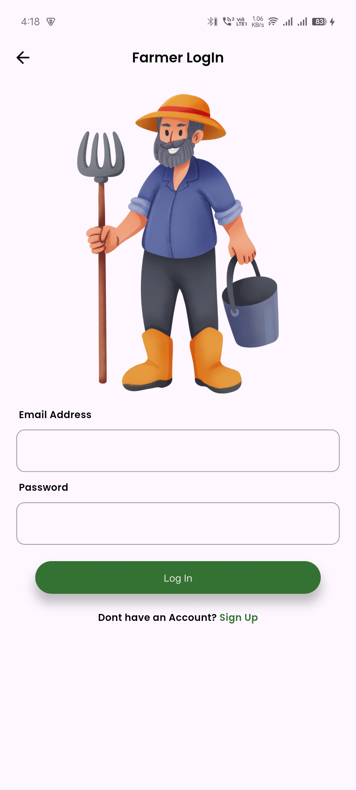
      <br />
      <sub><b></b></sub>
    </td>
    <td align="center">
      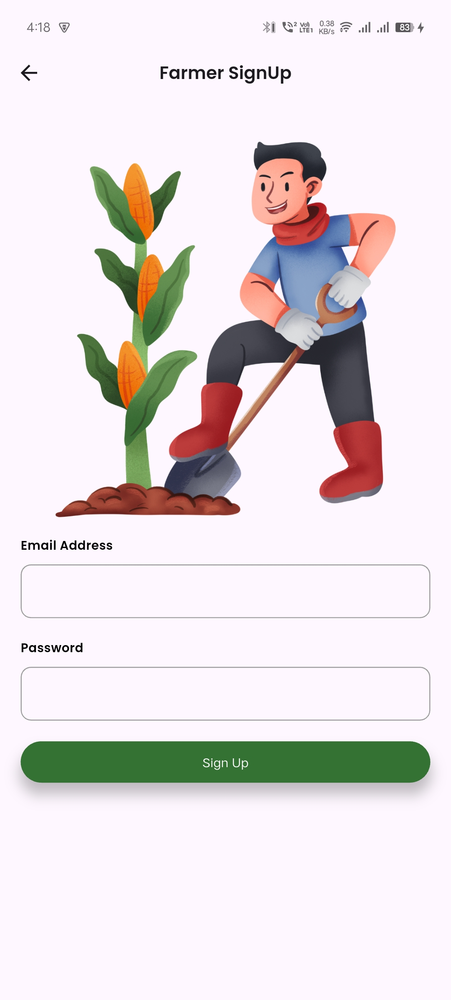
      <br />
      <sub><b> </b></sub>
    </td>
  </tr>
  <tr>
    <td align="center">
      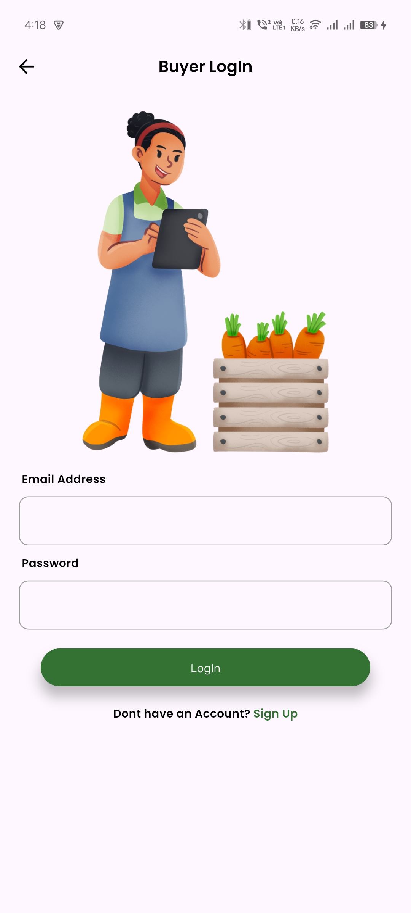
      <br />
      <sub><b> </b></sub>
    </td>
    <td align="center">
      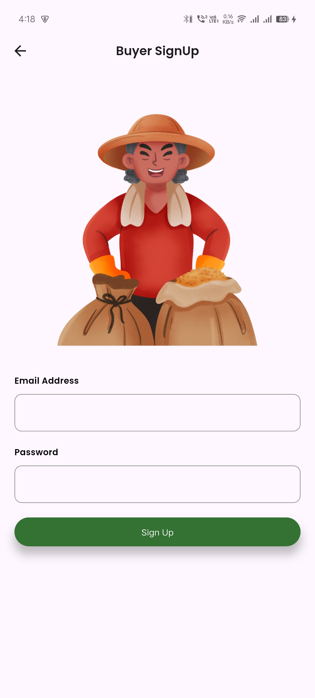
      <br />
      <sub><b> </b></sub>
    </td>
    <td align="center">
      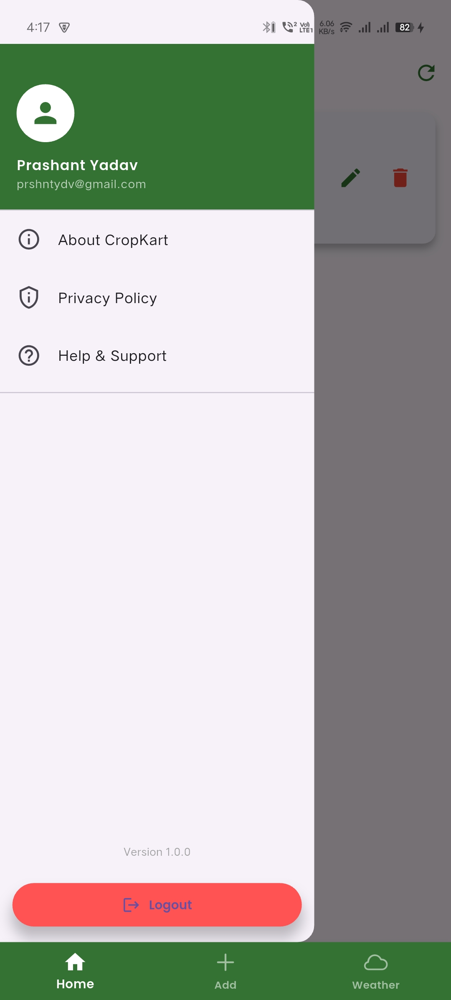
      <br />
      <sub><b> </b></sub>
    </td>
  </tr>
  <tr>
    <td align="center">
      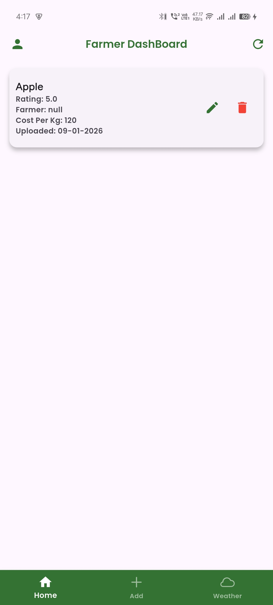
      <br />
      <sub><b> </b></sub>
    </td>
    <td align="center">
      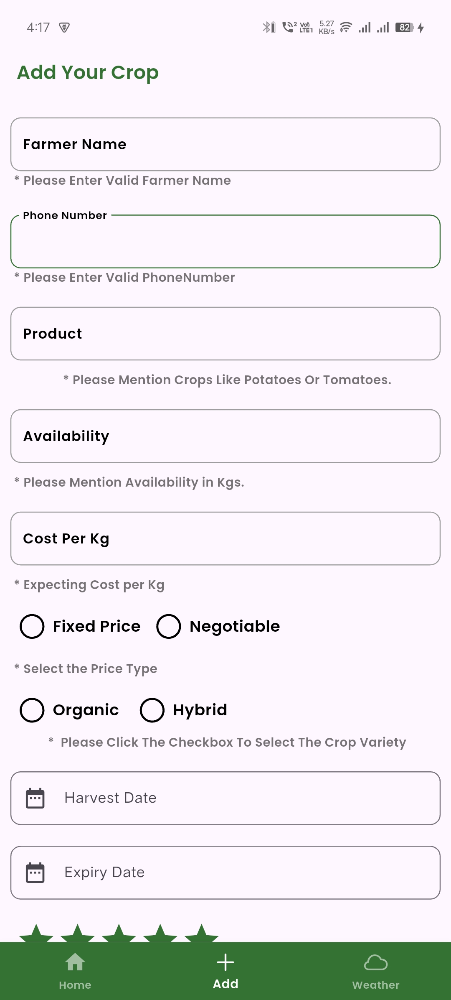
      <br />
      <sub><b> </b></sub>
    </td>
    <td align="center">
      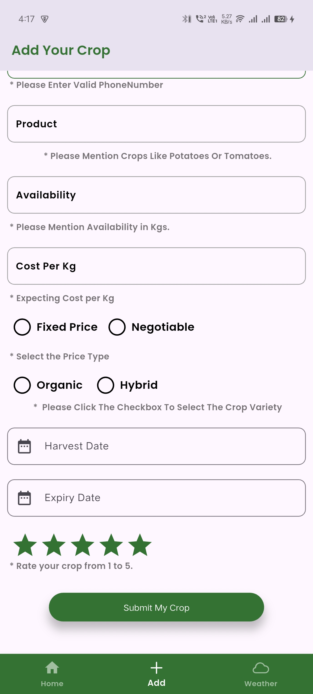
      <br />
      <sub><b> </b></sub>
    </td>
  </tr>
   <tr>
    <td align="center">
      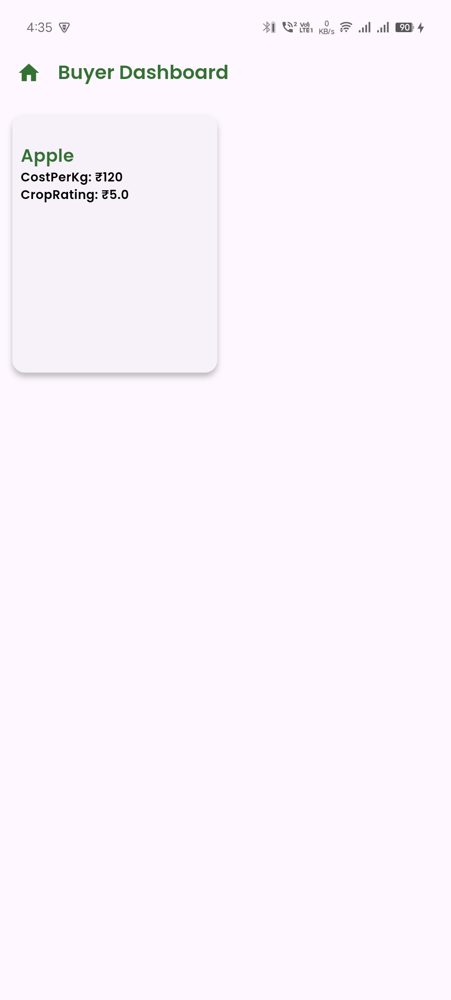
      <br />
      <sub><b> </b></sub>
    </td>
    <td align="center">
      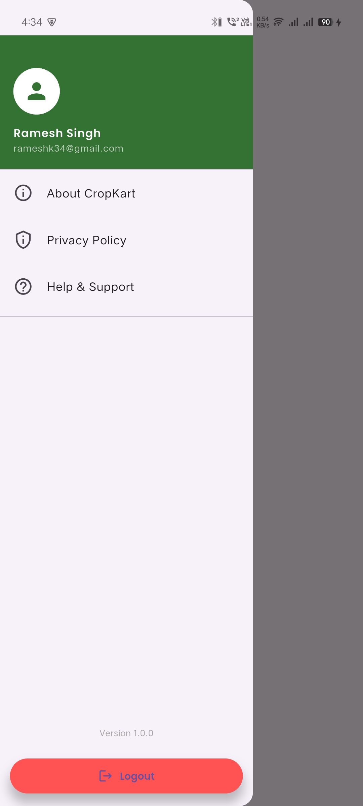
      <br />
      <sub><b></b></sub>
    </td>
    <td align="center">
      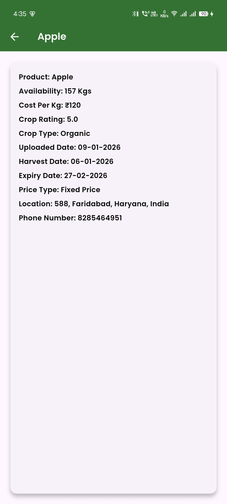
      <br />
      <sub><b></b></sub>
    </td>
  </tr>
   <tr>
    <td align="center">
      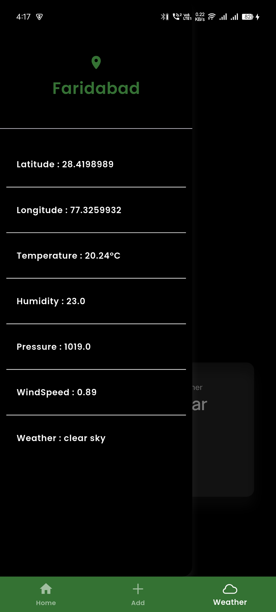
      <br />
      <sub><b></b></sub>
    </td>
    <td align="center">
      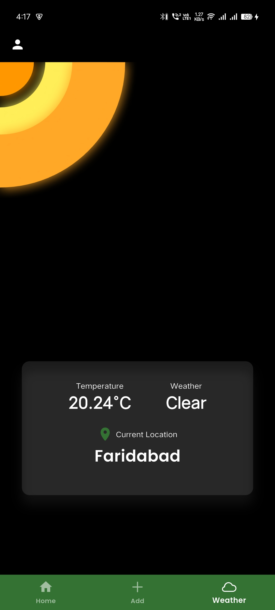
      <br />
      
  </tr>
</table>

## 📋 Prerequisites

Before you begin, ensure you have the following installed:

- Flutter SDK (v3.5.4 or higher)
- Dart SDK
- Android Studio or Visual Studio Code
- Xcode (for iOS development on macOS)
- Git
- Firebase Account

---

## 🚀 Installation

### 1️⃣ Clone the Repository

```bash
git clone https://github.com/yourusername/cropkart.git
cd corpkart
```

### 2️⃣ Install Dependencies

```bash
flutter pub get
```

### 3️⃣ Configure Weather API

1. Sign up for a free API key at [OpenWeatherMap](https://openweathermap.org/api)
2. Navigate to `lib/ApiKey.dart`
3. Replace the placeholder with your API key:

```dart
const String apiKey = 'YOUR_API_KEY_HERE';
```

### 4️⃣ Firebase Setup

#### Authentication Setup
1. Go to the [Firebase Console](https://console.firebase.google.com/)
2. Navigate to **Authentication** → **Sign-in method**
3. Enable **Email/Password** authentication

#### Firestore Database Setup
1. In Firebase Console, go to **Firestore Database**
2. Create the following collections:
   - `farmers`
   - `buyers`
   - `crops`

#### Initialize Firebase in Your App

```dart
import 'package:firebase_core/firebase_core.dart';
import 'package:flutter/material.dart';

void main() async {
  WidgetsFlutterBinding.ensureInitialized();
  await Firebase.initializeApp();
  runApp(MyApp());
}
```

### 5️⃣ Run the App

```bash
flutter run
```

---

## 📦 Dependencies

Add these to your `pubspec.yaml`:

```yaml
dependencies:
  flutter:
    sdk: flutter
  firebase_core: ^3.3.4
  firebase_auth: ^3.3.4
  cloud_firestore: ^3.1.5
  geolocator: ^latest
  geocoding: ^latest
  weather_animation: ^latest
```

---

## 💡 Key Code Snippets

### User Authentication

**Sign Up**
```dart
Future<User?> signUp(String email, String password) async {
  try {
    UserCredential userCredential = await FirebaseAuth.instance
        .createUserWithEmailAndPassword(email: email, password: password);
    return userCredential.user;
  } catch (e) {
    print("Error: $e");
    return null;
  }
}
```

**Sign In**
```dart
Future<User?> signIn(String email, String password) async {
  try {
    UserCredential userCredential = await FirebaseAuth.instance
        .signInWithEmailAndPassword(email: email, password: password);
    return userCredential.user;
  } catch (e) {
    print("Error: $e");
    return null;
  }
}
```

### Firestore Operations

**Add Crop Data**
```dart
FirebaseFirestore firestore = FirebaseFirestore.instance;

Future<void> addCropData(String cropId, Map<String, dynamic> cropData) async {
  try {
    await firestore.collection('crops').doc(cropId).set(cropData);
  } catch (e) {
    print("Error: $e");
  }
}
```

**Fetch Available Crops**
```dart
Future<QuerySnapshot> getCrops() async {
  return await firestore.collection('crops').get();
}
```

---

## 🏗️ Project Architecture

```
cropkart/
├── lib/
│   ├── main.dart
│   ├── ApiKey.dart
│   ├── screens/
│   │   ├── farmer_dashboard.dart
│   │   └── buyer_dashboard.dart
│   ├── services/
│   │   ├── auth_service.dart
│   │   └── firestore_service.dart
│   └── widgets/
├── android/
├── ios/
└── pubspec.yaml
```

---

## 🤝 Contributing

We welcome contributions! Here's how you can help:

1. **Fork** the repository
2. **Create** a new branch (`git checkout -b feature/amazing-feature`)
3. **Commit** your changes (`git commit -m 'Add some amazing feature'`)
4. **Push** to the branch (`git push origin feature/amazing-feature`)
5. **Open** a Pull Request

---

## 📄 License

This project is licensed under the MIT License - see the [LICENSE](LICENSE) file for details.

---

## 📧 Contact

**Prashant Yadav**

- Email: prshntydvpvt@gmail.com
- GitHub: [@Prashant Yadav](https://github.com/prashant000000004)

---

## 🙏 Acknowledgments

- Flutter team for the amazing framework
- Firebase for backend infrastructure
- OpenWeatherMap for weather API
- All contributors who help improve Farm Mate

---
